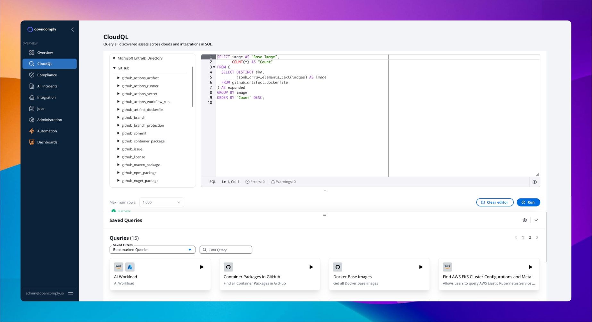

<p align="center">
  <a href="https://opencomply.io">
    <picture>
      <!-- Dark mode logo -->
      <source media="(prefers-color-scheme: dark)" srcset="https://github.com/opengovern/opencomply/blob/main/assets/logos/logo-dark.png">
      <!-- Light mode logo -->
      <source media="(prefers-color-scheme: light)" srcset="https://github.com/opengovern/opencomply/blob/main/assets/logos/logo-light.png">
      <!-- Fallback/logo -->
      
    </picture>
  </a>
</p>


<p align="center">
  
</p>


# opencomply

#### Simplify security and compliance across your entire stack—from containers to cloud—so you can ship faster and worry less.

## What OpenComply Does

- **Full Visibility**: See everything across your clouds and tools—infrastructure, data, identities, configurations, and security.
- **Centralized Compliance**: Manage and enforce all your compliance checks for configurations, processes, and security in one place.
- **Automated Policies**: Define custom rules (best practices, regulatory, or internal) as code (SQL policies), manage them in Git, and integrate with your tools and CI/CD.

## Features

- 🔍 **Unified Visibility**: Explore all 1000+ assets (containers, cloud resources, etc.) using SQL.
- ⚙️ **Custom Controls**: Define compliance checks as SQL policies, managed in Git.
- ✅ **Flexible Compliance**: Easily create custom, complex checks.
- 🚀 **Scalable Audits**: Handles thousands of checks across large infrastructures.
- 🔗 **Extensive Integrations**: Connect to AWS, Azure, DigitalOcean, Linode, GitHub, and more.

## Why OpenComply?

- **Unified Security & Compliance**: Manage security and compliance checks together, simplifying audits.
- **Automated Governance**: Continuously monitor and enforce policies, reducing manual effort.
- **Developer Friendly**: Define compliance as code, integrating seamlessly with your workflow.
- **Scalable & Flexible**: Adapt to your growing infrastructure and unique requirements.
  

## 🚀 Quick Start

Get up and running in minutes:

Install on any Kubernetes clusters with at least 3 nodes (4 vCPUs x 16GB RAM each).

```bash
helm repo add opencomply https://charts.opencomply.io --force-update
helm install -n opencomply opencomply opencomply/opencomply --create-namespace
kubectl port-forward -n opencomply svc/nginx-proxy 8080:80
```

Open http://localhost:8080/ in your browser, sign in with ```admin@opencomply.io``` as the username and ```password``` as the password.

App includes sample data.

## Next Steps

*   **Explore the Documentation:** Visit [docs.opencomply.io](https://docs.opencomply.io) for detailed information and guides.
*   **Try Cloud for Free:** Sign up for our hosted Cloud offering (coming soon).
