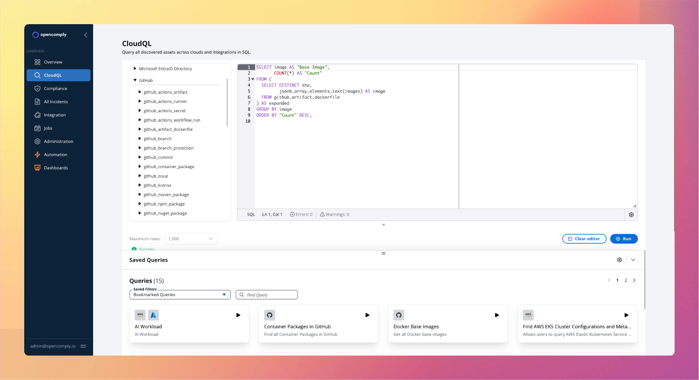

<p align="center">
  <a href="https://opencomply.io">
    <picture>
      <!-- Dark mode logo -->
      <source media="(prefers-color-scheme: dark)" srcset="https://github.com/opengovern/opencomply/blob/main/assets/logos/logo-dark.png">
      <!-- Light mode logo -->
      <source media="(prefers-color-scheme: light)" srcset="https://github.com/opengovern/opencomply/blob/main/assets/logos/logo-light.png">
      <!-- Fallback/logo -->
      
    </picture>
  </a>
</p>


<p align="center">
  
</p>

**opencomply** automates security and compliance across your clouds, platforms, and tools, empowering you to ship faster and worry less.

* **See everything:** Get a complete view of your infrastructure, data, identities, configurations, and security posture across all your clouds and tools.
* **Govern anything:** Assess and enforce compliance for configurations, processes, and security across your entire environment.
* **Adapt easily:** Define any rule — best practices, regulatory, change requirements — as code, manage them in Git, and integrate with your existing tools and CI/CD pipeline.


## Key Features

- **Extensible**: Plugins for Render, Fly.io, GitHub, AWS, Azure, Cloudflare, DigitalOcean, Linode, OpenAI, Cohere, EntraID, and more included. Easily write your own in Go.
- **Scalable**: Utilizes KEDA and OpenSearch to easily scale and run thousands of checks and hours.
- **Tested**: Tested extensively on over $50M+ of cloud infrastructure.

## Getting Started

**Helm Installation:** 

opencomply is written in go, and uses KEDA & OpenSearch. It's little resource heavy - at least 3 nodes (4 vCPUs x 16GB RAM each). Optimizations are in flight to reduce.

```bash
helm repo add opencomply https://charts.opencomply.io --force-update
helm install -n opencomply opencomply opencomply/opencomply --create-namespace --timeout=10m
kubectl port-forward -n opencomply svc/nginx-proxy 8080:80
```
Open http://localhost:8080/ in your browser, sign in with ```admin@opencomply.io``` as the username and ```password``` as the password.

The app comes loaded with sample data. 

## Next Steps

- **Download Open-Source:** Access the latest stable release from our GitHub releases.
- **Try Cloud for Free:** Sign up for our hosted Cloud offering (coming soon).
- **Explore Resources:** Check out recommended best practices and compliance guidelines:
  - Reliability & Security Best Practices
  - FedRAMP, HIPAA, CIS, CISA Cyber Essentials
- **Customize:** Configure controls, frameworks, roles, SSO, policies, queries, and tasks to suit your environment.
